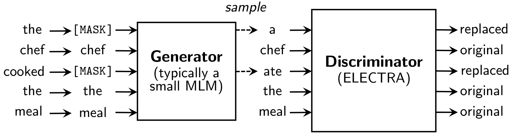

# Electra pre-trained model using Vietnamese corpus

## Overview

[ELECTRA](https://openreview.net/pdf?id=r1xMH1BtvB) is a new method for self-supervised language representation learning. This repository contains the pre-trained Electra small model (tensorflow 2.1.0) trained in a large Vietnamese corpus (~50GB of text). 

According to the [author's description](https://ai.googleblog.com/2020/03/more-efficient-nlp-model-pre-training.html):
> Inspired by generative adversarial networks (GANs), ELECTRA trains the model to distinguish between “real” and “fake” input data. Instead of corrupting the input by replacing tokens with “[MASK]” as in BERT, our approach corrupts the input by replacing some input tokens with incorrect, but somewhat plausible, fakes. For example, in the below figure, the word “cooked” could be replaced with “ate”. While this makes a bit of sense, it doesn’t fit as well with the entire context. The pre-training task requires the model (i.e., the discriminator) to then determine which tokens from the original input have been replaced or kept the same.



All corpus was tokenize using [coccoc-tokenizer](https://github.com/coccoc/coccoc-tokenizer). To using this trained model correctly, let install coccoc-tokenizer lib first.

## Prepare environment using conda

```bash
# Create new env
conda create -n electra-tf python=3.7
conda activate electra-tf
pip install -r requirements.txt

# Install coc coc tokenizer
git clone https://github.com/coccoc/coccoc-tokenizer.git
cd coccoc-tokenizer
mkdir build && cd build
cmake -DBUILD_PYTHON=1 ..
make install
cd ../python
python setup.py install

```

## Using trained model

Let follow this [tutorial](https://github.com/nguyenvulebinh/vi-electra/blob/master/gen_dis_explorer.ipynb) to use the trained model. You can also play around in this [colab](https://colab.research.google.com/drive/1cBQ7FQJBDeXn8UAbB3qVyaDFZGLdYM-P) notebook.

## Training

Please follow the root [repository](https://github.com/google-research/electra) for training model.


## Convert model

Because the root repository base on tensorflow 1.x, run the following command to convert model to tensorflow 2.x

```bash
pip install torch==1.4.0
python convert_tf2.py
```

Before running this script, ensure put necessary files in the folders.

- ./model_pretrained/raw_model checkpoint model that train from this [repository](https://github.com/google-research/electra)
- ./model_pretrained/config_files include config file that contains model architecture (generator and discriminator models). Config file default is Electra small model.


WARNING: The file models are committed using git lfs. For the instruction on how to use git lfs, please follow this [link](https://git-lfs.github.com/)

Instruction to clone this project in ubuntu 
```bash
sudo apt-get install git-lfs
git lfs install
git clone https://github.com/nguyenvulebinh/vi-electra.git

```